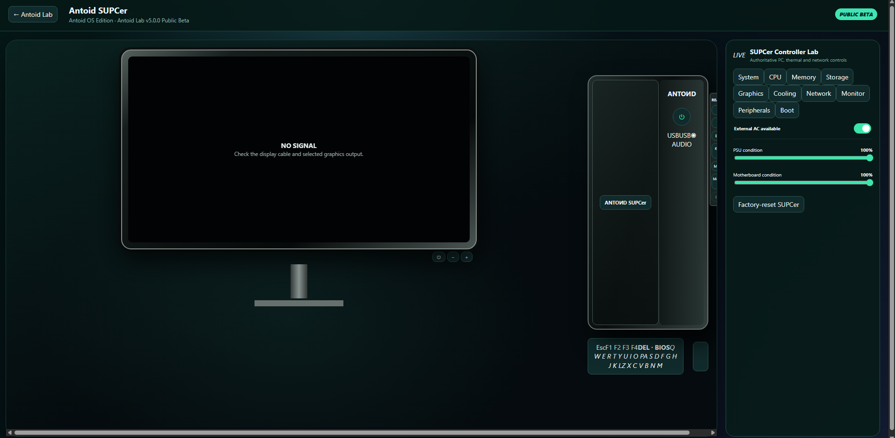

# Antoid Lab v5.0.0 Public Beta

> **Public beta:** This is a pre-release simulation. Features and persisted-state formats may continue to evolve before a stable 5.0 release.

Antoid Lab is a self-contained React simulation of the Antoid 1 smartphone, Antoid UTV home-entertainment laboratory, Antoid SUPCer physical PC, ANRouter, and Antoid OS environments. It runs entirely in the browser and persists simulated device state locally.

> **AI-generated project:** The complete project was generated with artificial intelligence in Hungary. This disclosure applies to the source code, interface, documentation, simulated media, and other project content.

## Screenshots

### Antoid Lab


### Antoid 1


### Antoid 1 Controller Lab


### Antoid UTV 1


### Decoder Box


### DVD Player


### Antoid SUPCer (Beta)



## Highlights

- Interactive Antoid 1 phone hardware, boot, setup, lock, power, charging, battery degradation, damage, and disassembly simulations.
- Physical SIM tray, permanent Yettel HU, Telekom HU, and One HU identities, programmable eSIM profiles, dual-SIM operation, and 0–4 cellular signal bars.
- Simulated 5G, 4G, 3G, EDGE, VoNR, VoLTE, VoWiFi, UMTS, and GSM behavior with shared bandwidth, latency, reliability, and handover controls.
- Persistent Antoid OS apps, notifications, Quick Settings, launcher, communications, camera, gallery, browser, utilities, store, accessibility, and local downloadable apps.
- Antoid UTV 1 with physical unboxing, antenna selection, four independent Hungarian DVB-T2 transmitter sites, exact-frequency MUX A–E scanning, EPG, radio, and channel management.
- Decoder Box with conditional-access cards, free and coded services, firmware updates, controlled failures, recovery tools, and HDMI/SCART output.
- Physical DVD Player with tray, disc, region, optical-read, playback, and shared HDMI behavior.
- Controller Lab controls for hardware, radio, RF propagation, weather, network, services, faults, batteries, Decoder, DVD, and connected diagnostics.
- Antoid SUPCer with physical power, monitor and I/O cables; an openable chassis; compatible RAM and PCIe installation; SATA, power, display, fan, thermal, POST, and fault behavior.
- Interactive firmware startup, BIOS configuration, boot ordering, component detection, monitor signal states, and an Antoid OS 7 desktop with persistent windows and files.
- Antoid OS 7 Files, Browser, Paint, Media Player, Text Editor, Calculator, System Information, System Monitor, Control Panel, playable Orbital Blocks and Circuit Pairs games, parts catalog, and `.ant` package installer.
- A shared ANRouter used by the phone, UTV, and SUPCer with editable SSID/password, Wi-Fi bands, WAN, LAN/DHCP, client naming/blocking, and Controller Lab network conditions.

## Requirements

- Node.js 20 or newer
- npm
- A current desktop browser

## Run locally

```bash
npm install
npm run dev
```

Open the local address printed by Vite, normally <http://localhost:5173>.

## Validate a production build

```bash
npm test
npm run build
npm run preview
```

The production output is written to `dist/`.

## Persistence and reset

Antoid stores its simulated OS and Lab state in browser `localStorage`. State survives refreshes and application restarts.

For a complete return to unboxing and first-time setup, use the destructive reset provided inside **Controller Lab → Phone Disassembly & Damage**. The UTV environment also provides **Reset / repack Lab** for its shared physical world.

Version 5 migrates older recoverable Antoid state in place. The SUPCer has its own reset in **SUPCer Controller Lab → System**, and ANRouter defaults can be restored from its local administration page.

## Important simulation notes

- Antoid Lab is a browser simulation, not phone, radio, broadcast, payment, or emergency-service software.
- Carrier, DVB-T2, Wi-Fi, weather, hardware, media, and internet behavior are locally simulated.
- Signal strength is represented using exactly zero through four cellular bars.
- No real calls, messages, purchases, broadcasts, or carrier actions are made.

## Known Public Beta limitations

- SUPCer is a state-driven browser simulation, not a CPU emulator or virtual machine; firmware and Antoid OS behavior model the visible hardware state without executing machine code.
- Antoid Browser serves local simulated pages and network outcomes. It does not embed arbitrary external websites.
- `.ant` packages install declarative simulated metadata, launcher entries, permissions, files, versions, and associations; they never execute native or untrusted code.
- Persistence is local to the current browser profile. Cloud sync and multi-user account synchronization are outside this beta.

## Project structure

```text
src/apps/        Antoid OS applications
src/components/  Phone, UTV, Decoder, DVD, SUPCer, Controller Lab, and system UI
src/config/      Version and product configuration
src/services/    Hardware, cellular, RF, battery, media, SUPCer, router, and persistence models
src/state/       Persistent global state and reducer logic
```

## Changelog

See [CHANGELOG.md](CHANGELOG.md) for the current 5.0.0 Public Beta release notes and earlier release history.

## License

Antoid Lab is available under the [MIT License](LICENSE).
