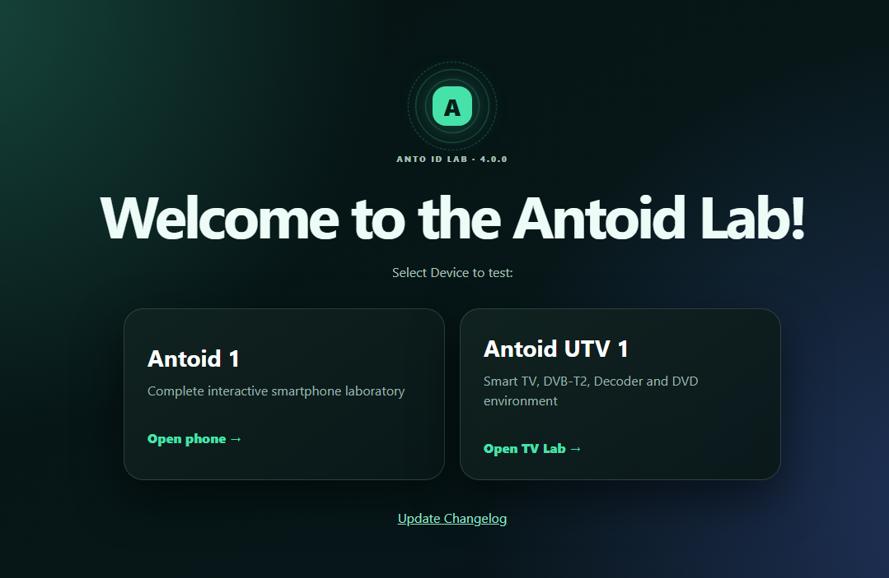
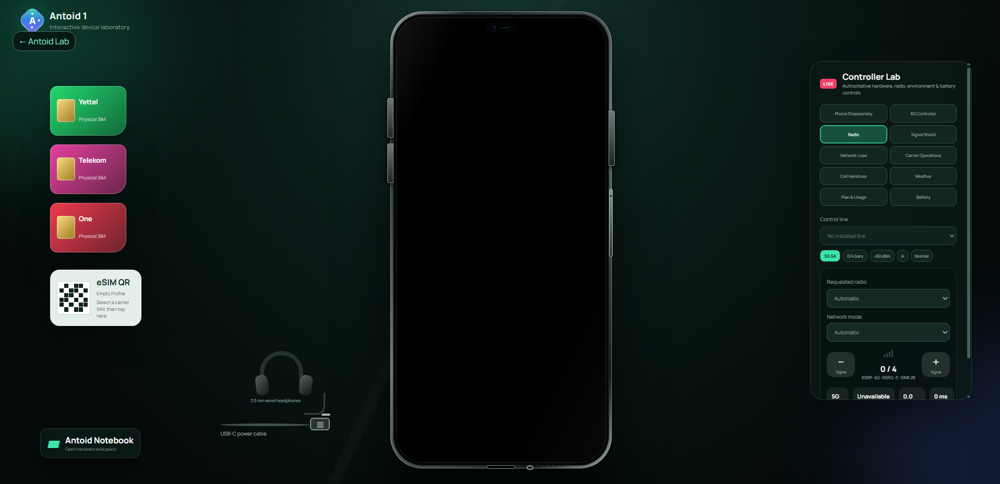
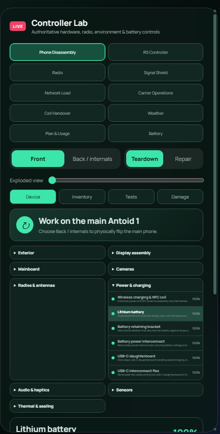
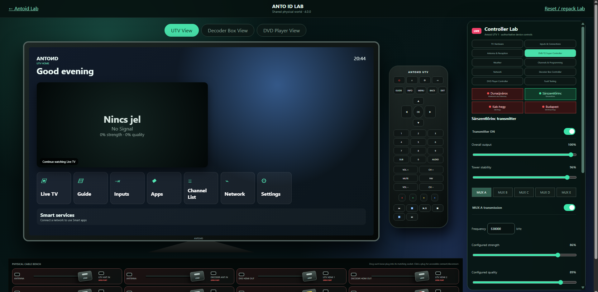
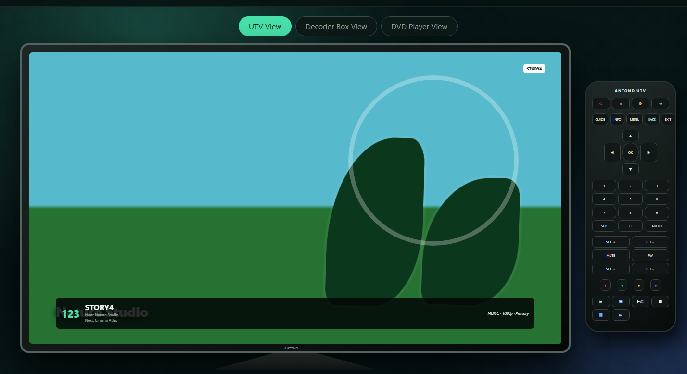
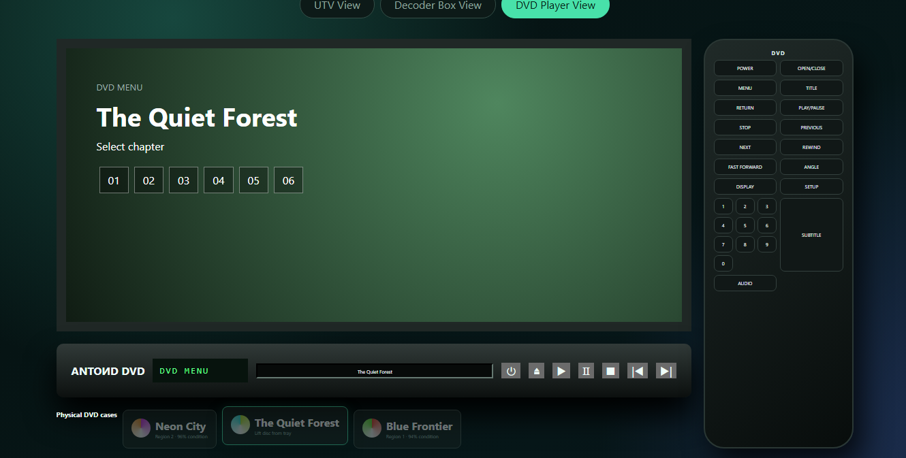

# Antoid Lab 4.0.0

Antoid Lab is a self-contained React simulation of the Antoid 1 smartphone, Antoid OS, and the Antoid UTV home-entertainment laboratory. It runs entirely in the browser and persists simulated device state locally.

> **AI-generated project:** Antoid Lab 4.0.0 was generated using artificial intelligence. This disclosure applies to the source code, interface, documentation, simulated media, and other project content. This README was also generated with AI. The project was developed in Hungary.

## Screenshots

### Antoid Lab



### Antoid 1



### Antoid 1 Controller Lab



### Antoid UTV 1



### Decoder Box



### DVD Player



## Highlights

- Interactive Antoid 1 phone hardware, boot, setup, lock, power, charging, battery degradation, damage, and disassembly simulations.
- Physical SIM tray, persistent simulated Yettel HU, Telekom HU, and One HU carrier identities, programmable eSIM profiles, dual-SIM operation, and 0–4 cellular signal bars.
- Simulated 5G, 4G, 3G, EDGE, VoNR, VoLTE, VoWiFi, UMTS, and GSM behavior with shared bandwidth, latency, reliability, and handover controls.
- Persistent Antoid OS apps, notifications, Quick Settings, launcher, communications, camera, gallery, browser, utilities, store, accessibility, and local downloadable apps.
- Antoid UTV 1 with physical unboxing, antenna selection, four independent Hungarian DVB-T2 transmitter sites, exact-frequency MUX A–E scanning, EPG, radio, and channel management.
- Decoder Box with conditional-access cards, free and coded services, firmware updates, controlled failures, recovery tools, and HDMI/SCART output.
- Physical DVD Player with tray, disc, region, optical-read, playback, and shared HDMI behavior.
- Controller Lab controls for hardware, radio, RF propagation, weather, network, services, faults, batteries, Decoder, DVD, and connected diagnostics.

## Requirements

- Node.js 20 or newer
- npm
- A current desktop browser

## Run locally

```bash
npm install
npm run dev
```

Open the local address printed by Vite, normally <http://localhost:5173>.

## Validate a production build

```bash
npm test
npm run build
npm run preview
```

The production output is written to `dist/`.

## Persistence and reset

Antoid stores its simulated OS and Lab state in browser `localStorage`. State survives refreshes and application restarts.

For a complete return to unboxing and first-time setup, use the destructive reset provided inside **Controller Lab → Phone Disassembly & Damage**. The UTV environment also provides **Reset / repack Lab** for its shared physical world.

## Important simulation notes

- Antoid Lab is a browser simulation, not phone, radio, broadcast, payment, or emergency-service software.
- Carrier, DVB-T2, Wi-Fi, weather, hardware, media, and internet behavior are locally simulated.
- Cellular signal strength is represented using exactly zero through four bars.
- No real calls, messages, purchases, broadcasts, or carrier actions are made.

## Project structure

```text
src/apps/        Antoid OS applications
src/components/  Phone, UTV, Decoder, DVD, Controller Lab, and system UI
src/config/      Version and product configuration
src/services/    Hardware, cellular, RF, battery, media, and persistence models
src/state/       Persistent global state and reducer logic
screenshots/     README screenshots
```

## Changelog

See [CHANGELOG.md](CHANGELOG.md) for the current 4.0.0 release notes and earlier release history.

## License

Antoid Lab is available under the [MIT License](LICENSE).
